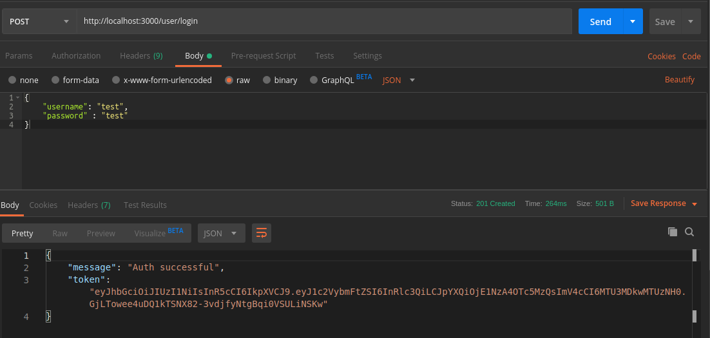

# Aaroza-Backend-Solution

## Installation instructions
1. First you have to install node package
    ```
    npm install
    ```
2. To start the node server you have to use below command in terminal
    ```
    node server.js
    ```

## Backend Solution

### Task 1.  GET - `host/api/actors` will return below screenshot


### Task 2.1. POST - `host/api/user/signup` will accept `username`, `password` and will return jwt token. `username` must be unique.


### Task 2.2. If someone wanted to signuo with existed `username` in database it will show an error.


### Task 3. POST - `host/api/user/login` will accept `username`, `password` and will return jwt token.



### Task 4.1. GET - `host/api/movies` will have authentication. For authentication you have to use `Authorization` Header. You will give  `bearer` , `" "` and an jwt_token with it.
    
```
bearer jwt_token
```

### Task 4.2. Authenticated users can use GET route `host/api/movies` and it will return all of the movies


### Task 4.3. If user isn't authenticated then it will give you an error

